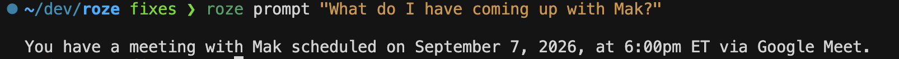
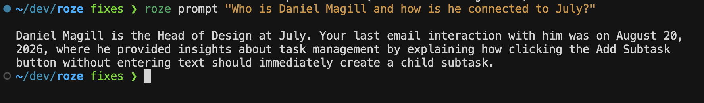
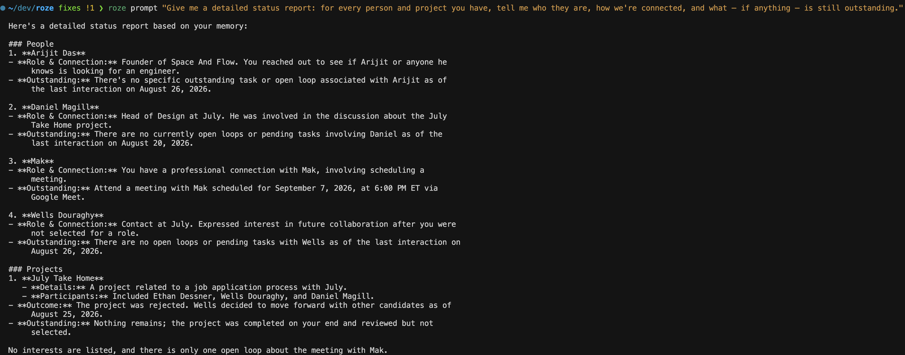
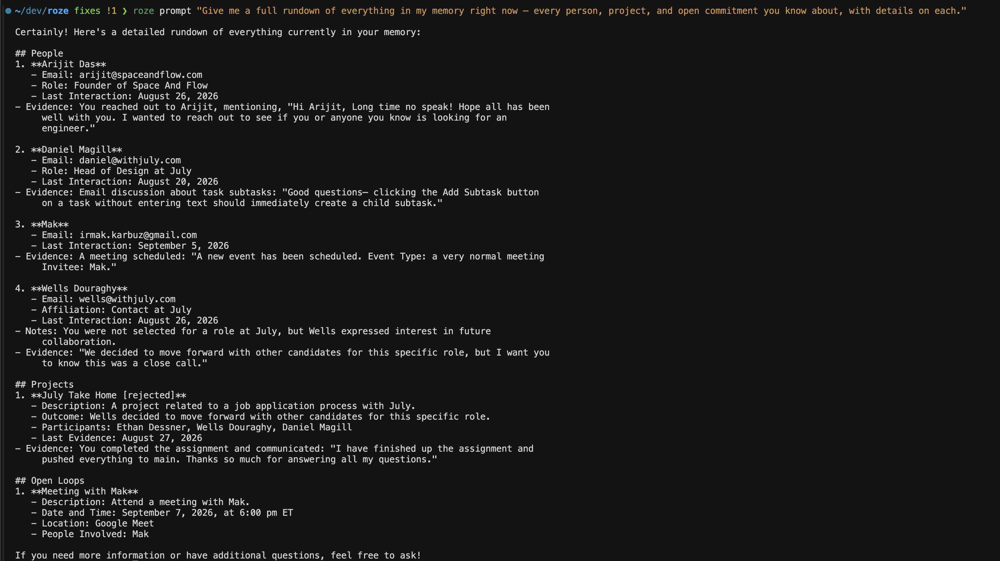

# Roze — Personal Memory System

A CLI that connects to your Gmail account and turns your email history into a lightweight, queryable "brain" for a personal AI assistant. The brain tracks four kinds of durable memory extracted from your inbox:

- **People** — durable context about who you communicate with
- **Projects** — outcome-oriented efforts with an endpoint
- **Interests** — recurring topics, organizations, tools, hobbies, and subjects
- **Open loops** — unresolved commitments, follow-ups, decisions, or actions

The CLI exposes exactly three commands: `auth`, `generate`, and `prompt <query>`.

## Prerequisites

- Node.js 20+
- A Google Cloud project with:
  - The Gmail API enabled
  - An OAuth consent screen in **Testing** mode, with scope `https://www.googleapis.com/auth/gmail.readonly`, and `agent@roze.ai` added as a test user
  - An OAuth Client ID (type **Desktop app** is simplest; if using **Web application**, add `http://localhost:4321/callback` as an authorized redirect URI)
- An OpenAI API key (used to extract the brain and to answer `prompt` queries)

## Setup

```bash
git clone <this-repo-url>
cd roze
npm install
cp .env.example .env
# then edit .env and fill in:
#   GOOGLE_CLIENT_ID=
#   GOOGLE_CLIENT_SECRET=
#   OPENAI_API_KEY=
npm run build
npm link   # optional: makes the `roze` command available globally
```

Without `npm link`, you can run every command via `npm run start -- <command>` (e.g. `npm run start -- auth`) or directly with `node dist/cli.js <command>`.

## Usage

```bash
roze auth                       # 1. Sign in with Google, grant Gmail readonly access
roze generate                   # 2. Read your email history and build the brain
roze prompt "Who is Alex and what are we working on together?"
roze prompt "What's still open with the Acme contract renewal?"
roze prompt "What tools or topics have I been reading about lately?"
```

For large mailboxes, `roze generate --limit 100` only processes the 100 most recent messages, which is useful for a quick end-to-end test before committing to a full run. `generate` self-throttles its Gmail API calls (default 8 req/sec, override with `ROZE_GMAIL_RPS`) and automatically backs off and retries on 429/quota errors, so a full run on a large mailbox will simply take longer rather than fail — it also caches fetched messages in `~/.roze/gmail-cache.json` so re-running `generate` after an interruption doesn't re-fetch messages already downloaded.

- `auth` opens your browser to the Google consent screen and stores tokens locally.
- `generate` fetches your Gmail history (with a progress bar), extracts People/Projects/Interests/Open Loops in batches via OpenAI, runs a final reconciliation pass to close anything the per-batch view couldn't tell was already settled, and persists the result to a local SQLite database.
- `prompt <query>` is a single-trip command: it loads the full brain, injects it as context, and asks OpenAI to answer your question. It is not an interactive chatbot.

## Demo: sample queries and answers

Four `roze prompt` queries against a real generated brain, from simple lookups to a full synthesis across every category.

**A single open loop:**

> `roze prompt "What do I have coming up with Mak?"`



**A person, and their connection to a project:**

> `roze prompt "Who is Daniel Magill and how is he connected to July?"`



**A detailed status report across every person and project** — a good example of the memory distinguishing how different projects concluded (rejected vs. cancelled vs. completed) and correctly reporting nothing outstanding once one has ended:

> `roze prompt "Give me a detailed status report: for every person and project you have, tell me who they are, how we're connected, and what - if anything - is still outstanding."`



**A full rundown synthesizing People, Projects, and Open Loops in one answer,** with evidence snippets cited for each entry:

> `roze prompt "Give me a full rundown of everything in my memory right now - every person, project, and open commitment you know about, with details on each."`



## Where local state lives

All local state — OAuth tokens, the SQLite brain database, and a small Gmail response cache — lives under `~/.roze/` and is never written into the repo:

- `~/.roze/credentials.json` — OAuth tokens from `auth`
- `~/.roze/brain.db` — the generated brain (SQLite)
- `~/.roze/gmail-cache.json` — cached raw Gmail message fetches (speeds up re-running `generate`)

To fully reset local state:

```bash
rm -rf ~/.roze
```

## Design decisions and tradeoffs

### The central decision: a distilled memory, not an email index

The brain stores condensed, structured facts about people, projects, interests, and open loops. It deliberately does **not** store or index individual messages. This is the decision everything else follows from, and has some downsides: `roze prompt` can answer *"what's still open with Alex, and when did we last actually talk?"* but it cannot answer *"what was the last email I received?"*. The latter is an inbox query, not a memory query, and supporting it would mean building a searchable message index, which works against the brief's "lightweight" framing and its instruction to keep the memory design easy to understand.

The middle ground I chose is an `evidence_snippet` on people, projects, and interests: a short concrete detail lifted from the actual email ("waiting on legal's redline before signing") rather than a generic restatement. That buys back most of the specificity you'd want from message-level access without maintaining an index. When a question truly falls outside the memory, `prompt` says so and then redirects to the closest thing it does know, rather than guessing or dead-ending.

### Storage and retrieval

- **SQLite over a vector DB.** Because the brain holds distilled summaries rather than raw email chunks, it's small enough to store relationally *and* to pass to the model in full at query time. Embeddings and similarity search would have added additional complexity for no gain at this scale.
- **Single-shot context injection over RAG.** The whole brain fits in one prompt, so `prompt <query>` formats it as text and makes exactly one model call. No retrieval step or no chat loop is required. This matches the "single-trip command" requirement.
- **Batch extraction over per-email extraction.** Messages are grouped into threads, then batched ~15 threads per model call. Per-email extraction would have been far more expensive, and frankly, *worse*: judging whether a commitment is still unresolved requires seeing the whole thread, not one message in isolation.
- **Name/email matching over embedding-based entity resolution.** People dedupe by email (falling back to name), projects by name, interests by topic — all case-insensitive. This is knowingly simple and will miss cases like one person writing from two addresses. Fuzzier resolution was the obvious next step I chose not to spend the scope on.

### Reasoning about outcomes, not just mentions

The hardest correctness problem here wasn't extraction, it was knowing when something has *ended*. The brain originally reported an earlier promise as an outstanding commitment on a project, even though a later message in that same thread had already decisively settled the matter (a rejection, in the case that surfaced the bug). The commitment wasn't outstanding, it was moot. Nothing was missing from the data; the model simply had no instruction to ask "did anything later settle this?"

Three changes address that, and they're layered because each catches a case the others can't:

- **Outcome determination happens first.** The extraction prompt now requires establishing how each thread actually turned out before extracting anything, explicitly enumerating terminal events (rejections, cancellations, questions answered, deadlines passed) and stating that a terminal event invalidates the commitments preceding it. Every candidate loop is judged as of the *newest* message, not the moment it was made.
- **Projects record how they ended, and *how* matters.** Status gained `cancelled`, `rejected`, and `stalled` alongside `completed`, plus an `outcome` field explaining how and why. `rejected` is its own status, not folded into `cancelled`: submitting work for review and being turned down is a different outcome from calling something off outright, and conflating them misreports what happened. Storing *why* something is closed means an answer can say "nothing is left, because…" instead of just silently omitting it. Resolved loops keep a `resolution_reason` for the same reason, and are rendered in a clearly-labeled separate section at query time rather than being dropped.
- **A reconciliation pass catches what no single batch can see.** Batches are extracted independently, so a commitment recorded from one thread can never be closed by a resolution that arrived in a *different* batch — no single call ever sees both. After all batches finish, `generate` makes one additional call over the whole assembled brain (small enough to pass in full) asking which loops are now moot and which projects are terminal. Terminal statuses are then sticky in the same way resolved loops already were, so an out-of-order batch can't revive a project that ended.

This is also why extraction runs on `gpt-4o` rather than `gpt-4o-mini` (override with `ROZE_MODEL`). Noticing that a later rejection invalidates an earlier promise, across a long thread, is exactly the multi-hop inference the smaller model got wrong.

### Defining "interaction" precisely

- A person's `last_interacted_at` is the most recent date they appear as sender or recipient of a **person-to-person** email. My first implementation used the newest email anywhere in the extraction batch, which meant an unrelated thread could donate its date to someone who wasn't on it — a plausible-looking but wrong answer.
- Automated senders (Calendly, `no-reply@`, DocuSign, Zoom, GitHub/LinkedIn notifications) are excluded from counting as interactions. A Calendly confirmation lists both parties' real addresses in its headers, so without this filter a scheduling notification would be misidentified as a personal exchange.
- **Known limitation, stated honestly:** projects still use a coarser batch-level date, because a project isn't tied to a single counterparty's email address the way a person is. The query prompt is told to treat project dates as approximate and not assert them with the same confidence as person dates.
- The account owner is excluded from People — both by instruction to the extraction model and by an address-match filter in code, since the user is not one of their own contacts.

### Operating against a real mailbox

Testing against a ~5,000-message account surfaced constraints that a small test inbox never would:

- **Gmail per-user quota.** Reactive backoff alone wasn't enough; `generate` now self-throttles ahead of time (sliding window, 8 req/sec by default, tunable via `ROZE_GMAIL_RPS`) and retries with exponential backoff honoring `Retry-After`. Requesting a Google quota increase is possible but takes days, so the client has to behave well on the default budget. For testing purposes, I recommend using the `--limit 100` flag as this is sufficient enough to populate the brain test prompts properly.
- **`--limit <n>`** processes only the N most recent messages, which makes a full end-to-end verification loop take seconds rather than the better part of an hour.
- **Fetched messages are cached** in `~/.roze/gmail-cache.json`, so an interrupted or repeated `generate` doesn't re-download what it already has — which matters a lot when the extraction step is the part you're iterating on.

### What was cut

Per the brief's explicit non-goals: no web UI, no production Google verification (Testing mode with `agent@roze.ai` as a test user), no multi-user infrastructure, no processing of messages that arrive after the initial `generate` (no incremental sync or watch), and no integrations beyond Gmail.

On testing, I wrote 32 unit tests covering the logic where correctness is non-obvious — Gmail MIME/base64url parsing and thread grouping, brain merge/dedupe behavior, interaction-date attribution (including a regression test for the Calendly case above), terminal-state stickiness for projects and loops, and output wrapping. I deliberately did not test against live Google or OpenAI APIs, or chase coverage on glue code. `npm run typecheck` type-checks the tests too, which the build config intentionally excludes so they stay out of `dist/`.
